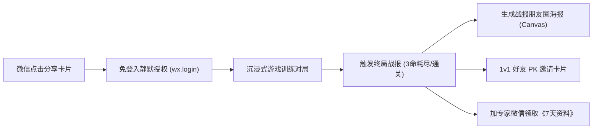

# K12 专注力认知训练游戏接入微信小程序完整技术实施指南

> **适用场景**：将现有的纯 H5/JS 科学认知训练游戏（母版01~21、舒尔特方格、N-Back等）无缝接入微信小程序生态。  
> **核心诉求**：低成本、零改造成本快速上线，打通微信登录、战报分享、天梯PK与私域加微引流闭环。

---

## 快速导航：本地工程与在线测试地址

### 1. 本地微信小程序工程源码目录
* **主小程序工程（当前正在开发与维护的主版本）**：
  ```text
  C:\Users\wizar\My Drive (wizard9018@gmail.com)\3.K12网站资源\专注力\miniprogram_听觉测试
  ```
  - **AppID**：`wx22e0e2231016d8c1`
  - **项目名称**：`qingliang-auditory-test`（清良思维听觉专注力测试 - 微信小程序原生版）
  - **客户端标题**：`各省中小学生专注力PK`
  - **模块布局**：
    - 专区 A：专业专注力测评 (`pages/home/home`, `pages/auditory/auditory`, `pages/visual/visual`, `pages/report/report`)
    - 专区 B：脑力训练营 50款/21母版 (`pages/train/intro/intro`, `pages/train/nback/nback`, `pages/train/schulte/schulte`, `pages/train/stroop/stroop`, `pages/train/grid/grid`, `pages/train/diff/diff`, `pages/train/report/report`, `pages/train/leaderboard/leaderboard`)
* **备用/实验子工程**：
  ```text
  C:\Users\wizar\My Drive (wizard9018@gmail.com)\3.K12网站资源\专注力\miniprogram_记忆力训练
  ```
  - **项目名称**：`qingliang-memory-training`（清良思维记忆力训练）

### 2. 现有可用于加载游戏的公网 HTTPS 在线测试地址
* **【推荐】游戏母版独立全屏运行视界（最适合 `<web-view>` 直接嵌入）**：
  ```text
  https://wizard9018.github.io/map-quiz/focus.html
  ```
  - **携带参数直达指定游戏与学员身份示例**：
    `https://wizard9018.github.io/map-quiz/focus.html?game=nback_flow&uid=OPENID_123&name=李同学`
* **宿主 Tab 嵌入视界（包含顶部导航栏与大地图 Quiz）**：
  ```text
  https://wizard9018.github.io/map-quiz/?tab=focus
  ```
* **关联的视听双通道综合专注力测评系统线上地址**：
  ```text
  https://wizard9018.github.io/attention-test/
  ```

---

## 目录
1. [三种接入架构方案选型与对比](#一-三种接入架构方案选型与对比)
2. [方案 A（推荐首期）：`<web-view>` 容器极速嵌入（1天上线）](#二-方案-a推荐首期web-view-容器极速嵌入1天上线)
3. [方案 B（推荐进阶）：原生 WXML/WXSS 组件化移植](#三-方案-b推荐进阶原生-wxmlwxss-组件化移植)
4. [微信生态核心转化链路打通（登录、分享、加微）](#四-微信生态核心转化链路打通登录分享加微)
5. [常见技术避坑指南（音频、缓存、安全区）](#五-常见技术避坑指南音频缓存安全区)
6. [在当前小程序工程中的具体落地改动点](#六-在当前小程序工程中的具体落地改动点)

---

## 一、 三种接入架构方案选型与对比

| 评估维度 | 方案 A：`<web-view>` 容器嵌入 (首推首期) | 方案 B：小程序原生移植 (WXML+WXSS) | 方案 C：微信小游戏 (Mini Game Canvas) |
| :--- | :--- | :--- | :--- |
| **代码复用率** | **100% 直接复用**，无需改写任何游戏逻辑 | 需重构：DOM 操作转为 `setData()` | 需彻底重构为纯 Canvas 渲染引擎 |
| **上线周期** | **1 天内**即可上线测试 | 1~2 周（逐个母版重写组件） | 3~4 周（需接入游戏引擎底层） |
| **热更新能力** | **极高**（服务端发版实时生效，绕过审核） | 较低（每次更新必须提交微信官方审核） | 较低（需提交小游戏官方审核） |
| **性能体验** | 优秀（现代移动端 WebView 跑 Grid/JS 极顺畅） | 极致原生级性能 | 极致复杂粒子动效支持 |
| **资质要求** | 普通小程序账号，需有**ICP 备案域名** | 普通小程序账号即可 | 需小游戏类目，文号与软著审核相对严格 |
| **推荐适用期** | **第一阶段敏捷上线与获客验证** | **核心游戏打磨或无服务器纯前端发布** | 强重度 3D / 物理引擎类游戏 |

> [!TIP]
> **最佳生产架构推荐（混合双轨架构）**：  
> - **小程序原生外壳**：包含“首页导航”、“每日打卡日历”、“成长报告总览”、“个人中心”。  
> - **游戏对局核心**：采用 `<web-view>` 打开 `focus.html`，游戏通关后通过 `postMessage` 将成绩回传给小程序原生页弹出终局战报与分享。

---

## 二、 方案 A（推荐首期）：`<web-view>` 容器极速嵌入（1天上线）

这是**目前最快落地**的方式，完全不影响现有代码的继续开发与迭代。

### 1. 微信小程序后台配置
1. 登录微信公众平台（`mp.weixin.qq.com`）。
2. 进入【开发】->【开发管理】->【业务域名】。
3. 添加你的服务器域名（如 `https://focus.yourdomain.com` 或已配置自定义域名的 GitHub Pages）。
4. 下载微信提供的校验文件（如 `xxxxxx.txt`），放置在网站根目录下保证公网可访问。
> *注：开发或体验阶段，可在微信开发者工具中直接勾选 `“不校验合法域名、web-view (业务域名)、TLS 版本以及 HTTPS 证书”` 立即免配置联调。*

---

### 2. 小程序端代码实现

#### (1) `pages/train/webview/webview.json`
配置页面全屏，隐藏系统导航栏（或自定义沉浸式）：
```json
{
  "navigationBarTitleText": "K12专注力科学训练",
  "navigationBarBackgroundColor": "#f7f5ef",
  "navigationBarTextStyle": "black"
}
```

#### (2) `pages/train/webview/webview.wxml`
使用 `<web-view>` 组件加载游戏页面，并监听 H5 回传的消息：
```xml
<!-- pages/train/webview/webview.wxml -->
<web-view src="{{ gameUrl }}" bindmessage="onWebviewMessage"></web-view>
```

#### (3) `pages/train/webview/webview.js`
处理用户身份注入与战报消息监听：
```javascript
// pages/train/webview/webview.js
Page({
  data: {
    gameUrl: '',
    shareData: {
      title: '我在专注力挑战中拿到了满分，敢来PK吗？',
      path: '/pages/home/home'
    }
  },

  onLoad(options) {
    const gameId = options.game || 'nback_flow';
    const userInfo = wx.getStorageSync('userInfo') || { nickName: '学员', openid: 'guest' };

    // 将用户身份信息与目标游戏作为 URL Query 注入
    const baseUrl = 'https://wizard9018.github.io/map-quiz/focus.html';
    const fullUrl = `${baseUrl}?game=${gameId}&uid=${userInfo.openid}&name=${encodeURIComponent(userInfo.nickName)}&v=${Date.now()}`;
    
    this.setData({ gameUrl: fullUrl });
  },

  // 接收来自 H5 postMessage 发送的战报数据
  onWebviewMessage(e) {
    const messages = e.detail.data;
    if (!messages || messages.length === 0) return;
    
    // 获取最新一条战报
    const latestReport = messages[messages.length - 1];
    console.log('[小程序端收到战报]', latestReport);

    if (latestReport.type === 'GAME_FINISH') {
      // 更新小程序的原生分享卡片信息
      this.setData({
        shareData: {
          title: `⚔️ 我在【${latestReport.gameTitle}】冲到了第 ${latestReport.level} 关 (${latestReport.score}分)，敢来挑战我吗？`,
          path: `/pages/train/webview/webview?game=${latestReport.gameId}&inviter=${latestReport.uid}&inviterScore=${latestReport.score}&inviterLevel=${latestReport.level}`
        }
      });
    }
  },

  // 转发给好友
  onShareAppMessage() {
    return this.data.shareData;
  },

  // 分享到朋友圈
  onShareTimeline() {
    return {
      title: this.data.shareData.title,
      query: `game=${this.options.game || 'nback_flow'}`
    };
  }
});
```

---

### 3. H5 网页端改造（现有 `focus.html` / `focus.js`）

#### (1) 引入微信 JSSDK
在 `focus.html` 的 `<head>` 中添加微信官方提供的 MiniProgram SDK（兼容浏览器环境）：
```html
<!-- 微信小程序 JSSDK，仅在微信环境下自动激活 -->
<script src="https://res.wx.qq.com/open/js/jweixin-1.6.0.js"></script>
```

#### (2) 在 `focus.js` 中接入战报回传与跳出逻辑
在游戏结算函数 `finishGame(isWin)` 内部加入以下通信逻辑：
```javascript
// 判断是否运行在微信小程序 web-view 内部
function isMiniProgram() {
  return window.__wxjs_environment === 'miniprogram' || /miniProgram/i.test(navigator.userAgent);
}

// 战报推送回小程序
function notifyMiniProgramResult(reportData) {
  if (window.wx && window.wx.miniProgram) {
    window.wx.miniProgram.postMessage({
      data: {
        type: 'GAME_FINISH',
        gameId: STATE.gameId,
        gameTitle: REGISTRY[STATE.gameId]?.title || '专注力母版训练',
        score: reportData.score,
        level: reportData.level,
        stars: reportData.stars,
        timestamp: Date.now()
      }
    });
  }
}

// “发给朋友挑战 PK” 按键支持一键调起小程序原生分享说明或直接回跳原生战报页
function handleShareToWeChat() {
  if (isMiniProgram() && window.wx && window.wx.miniProgram) {
    // 方案 1：直接跳转回小程序的原生战报/分享海报页
    window.wx.miniProgram.navigateTo({
      url: `/pages/train/report/report?score=${STATE.score}&level=${STATE.level}&game=${STATE.gameId}`
    });
  } else {
    // 方案 2：保持原有复制 URL 剪贴板逻辑
    copyShareLink();
  }
}
```

---

## 三、 方案 B（推荐进阶）：原生 WXML/WXSS 组件化移植

如果后续需要发布无服务器依赖的“纯单机纯原生”小程序版本，可将现在的核心母版组件化移植。

### 1. 核心架构映射表
| 原现有 H5 概念 | 微信小程序原生概念 | 说明与转换建议 |
| :--- | :--- | :--- |
| `document.getElementById('...')` | `this.setData({ ... })` | 绝对不能再操作真实 DOM，全部改为数据驱动视图渲染 |
| `<div class="grid-cell">` | `<view class="grid-cell {{ item.isActive ? 'active' : '' }}">` | 依靠状态数组驱动高亮与图标渲染 |
| `CSS Grid 布局` | `WXSS Grid 布局` | **完全通用**，保留 `repeat(3, 1fr)` 与 `aspect-ratio: 1/1` |
| `Web Audio API (AudioContext)` | `wx.createWebAudioContext()` 或 `wx.createInnerAudioContext()` | 小程序基础库 2.14+ 已原生支持 `WebAudioContext`，合成逻辑几乎无需修改！ |
| `requestAnimationFrame` / `setTimeout` | `setTimeout` + `this.timerId` | 页面 `onUnload()` 时必须显式 `clearTimeout`，防止内存泄漏 |

### 2. 小程序 Web Audio 纯音频合成器（直接复用现有合成算法）
小程序环境下无需外链 MP3，原生支持振荡器合成：
```javascript
// utils/audio.js
let audioCtx = null;

function getAudioContext() {
  if (!audioCtx && wx.createWebAudioContext) {
    audioCtx = wx.createWebAudioContext();
  }
  return audioCtx;
}

export function playSoundSuccess() {
  const ctx = getAudioContext();
  if (!ctx) return;
  const now = ctx.currentTime;
  const osc = ctx.createOscillator();
  const gain = ctx.createGain();
  osc.type = 'triangle';
  osc.frequency.setValueAtTime(523.25, now); // C5
  osc.frequency.setValueAtTime(659.25, now + 0.08); // E5
  gain.gain.setValueAtTime(0.15, now);
  gain.gain.exponentialRampToValueAtTime(0.001, now + 0.25);
  osc.connect(gain);
  gain.connect(ctx.destination);
  osc.start(now);
  osc.stop(now + 0.26);
}
```

---

## 四、 微信生态核心转化链路打通

接入微信小程序的核心优势在于转化闭环，以下是三大核心运营能力的实施方案：



### 1. 静默授权与用户标识同步（免登入体验）
小程序启动时通过 `wx.login` 获取 `code`，发给后端换取 `openid`，存入 Storage。进入 WebView 时直接以 `?uid=OPENID` 拼入，整个过程学员零感知，无需手动输手机号或密码。

### 2. 1v1 好友 PK 微信卡片定制
利用小程序的卡片自定义能力，当用户分享给好友时，好友点击卡片直接带参数进入迎战状态：
```javascript
onShareAppMessage() {
  return {
    title: `⚔️ 我在【N-Back刷新流】打出 ${this.data.score} 高分！你敢迎战吗？`,
    path: `/pages/train/webview/webview?game=nback_flow&inviterOpenid=${this.data.openid}&targetScore=${this.data.score}`,
    imageUrl: '/images/share_pk_banner.png' // 吸引眼球的PK对抗对决封面
  };
}
```

### 3. 专家咨询加微转化路径（规避微信外链拦截）
在微信小程序内，不能直接外跳到个人微信，推荐以下两种官方合规加微路径：
* **路径一：点击一键打开微信客服（最合规、流失率最低）**
  在小程序页面放置按钮：
  ```xml
  <button open-type="contact" class="btn-wechat-consult">
    👩‍🏫 专家 1v1 诊断与领取《7天训练营资料》
  </button>
  ```
  在公众平台后台配置客服自动回复：用户一发送消息，自动推送老师的企业微信名片或微信二维码。
* **路径二：引导保存企业微信名片海报**
  点击【领取资料】弹出弹窗，显示老师企微二维码，提供 `wx.previewImage`，长按可直接识别企业微信名片。

---

## 五、 常见技术避坑指南

### 1. iOS 静音键开关导致游戏没有声音
* **原因**：iPhone 侧边物理静音开关拨到静音状态时，默认会静音 Web Audio / `<audio>`。
* **解决办法**：在小程序 `app.js` 的 `onLaunch` 中声明全局音频不遵守静音键：
  ```javascript
  wx.setInnerAudioOption({
    obeyMuteSwitch: false, // 即使静音键打开，游戏音效依然可以播放
    mixWithOther: true     // 与背景音乐混音，不打断用户的音乐播放
  });
  ```

### 2. `<web-view>` 的网页强缓存问题
* **现象**：服务端更新了 `focus.js` 或 `focus.css`，但用户微信打开依然是旧版本。
* **解决办法**：
  1. 小程序拼接 URL 时强制加入版本号或时间戳：`focus.html?v=20260929_1`。
  2. Nginx 配置中对 HTML 文件设置协商缓存：
     ```nginx
     location ~* \.html$ {
         add_header Cache-Control "no-cache, must-revalidate";
     }
     ```

### 3. iPhone 全面屏底部黑条（安全区域 Safe Area 适配）
* **现象**：底部按钮被 iPhone 底部手势小黑条遮挡。
* **解决办法**：在 `focus.css` 中增加安全区域内边距：
  ```css
  .control-panel, .bottom-dock {
    padding-bottom: calc(16px + env(safe-area-inset-bottom));
  }
  ```

### 4. 微信环境下的下拉拖拽与回弹（Overscroll Rubber-band）
* **现象**：在手机上频繁点击或上下滑动时，网页出现“网页由 xxx 提供”的下拉白底回弹。
* **解决办法**：在 `focus.css` 的 `html, body` 声明：
  ```css
  html, body {
    overscroll-behavior-y: none;
    touch-action: manipulation;
    -webkit-overflow-scrolling: auto;
  }
  ```

---

## 六、 在当前小程序工程中的具体落地改动点

在 `C:\Users\wizar\My Drive (wizard9018@gmail.com)\3.K12网站资源\专注力\miniprogram_听觉测试` 中挂载现有 Web 游戏的推荐步骤：

1. **注册 WebView 路由**：
   在 `app.json` 的 `"pages"` 数组中追加：
   ```json
   "pages/train/webview/webview"
   ```
2. **创建页面文件**：
   在 `pages/train/webview/` 目录下创建 `webview.json`, `webview.wxml`, `webview.js`。
3. **改造卡片跳转**：
   在 `pages/home/home.js` 中的 `onTapGameCard` 方法内，当点击母版游戏卡片时直接跳转至：
   ```javascript
   wx.navigateTo({
     url: `/pages/train/webview/webview?game=${item.id}`
   });
   ```
4. **微信开发者工具联调**：
   使用微信开发者工具打开该目录，在右上角【详情】->【本地设置】勾选：
   - ☑️ **不校验合法域名、web-view (业务域名)、TLS 版本以及 HTTPS 证书**
   即可直接加载 `https://wizard9018.github.io/map-quiz/focus.html` 开始游玩与测试！
