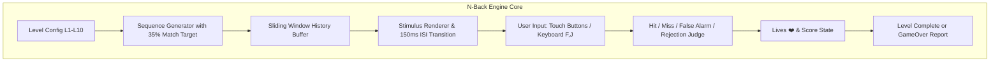

# 母版 01 · N-Back 工作记忆刷新流 Implementation Plan

> **For agentic workers:** REQUIRED SUB-SKILL: Use superpowers:subagent-driven-development to implement this plan task-by-task. Steps use checkbox (`- [ ]`) syntax for tracking.

**Goal:** 构建母版 01《N-Back 工作记忆刷新流》（`nback_flow`），实现 1~10 关自适应进阶（L1-L3 1-Back、L4-L7 2-Back、L8-L10 3-Back+干扰）、35% 强制匹配平衡算法、150ms 刺激间隔屏蔽期、双键触屏/键盘输入与背外侧前额叶（DLPFC）容量评估。

**Architecture:** 采用事件驱动的轻量状态机架构。游戏引擎生成受控伪随机序列并维系滑动堆栈；计时器驱动刺激卡片渲染与 ISI 白屏过渡；双输入通道（UI 触控 / 键盘监听）触发实时命中/误报判定与心数更新，关卡结束联动结算战报。

**Architecture Diagram:**

**Tech Stack:** 原生 HTML5 / CSS3 / ES6 JavaScript / Web Audio API / Node.js 自动化测试脚本。

## Global Constraints
- 无第三方重量级库依赖，保持毫秒级加载与极速响应。
- 界面严格遵循米白护眼学术风格（`#f7f5ef`）与 Duolingo 3D 立体触控按键。
- 保证移动端（375px~430px）与桌面端（支持键盘 F/J 与方向键）双端完美自适应。

---

### Task 1: 算法核心与离线单元测试 (`test_master_01_nback.js`)

**Files:**
- Create: `test_master_01_nback.js`

**Interfaces:**
- Produces: `generateNBackSequence(level, totalSteps, targetRatio)` 序列生成与判定函数

- [ ] **Step 1: 编写测试用例验证序列长度、靶向匹配率以及不同关卡 N 值的判定准确性**
- [ ] **Step 2: 运行测试并确认在未实现时测试报错**
- [ ] **Step 3: 实现纯函数算法模块并使测试通过**
- [ ] **Step 4: 提交算法模块代码**

---

### Task 2: 视觉样式与动效实装 (`focus.css`)

**Files:**
- Modify: `focus.css`

**Interfaces:**
- Consumes: CSS Variables, Stage Containers
- Produces: `.nback-card`, `.nback-symbol`, `.nback-grid-matrix`, `.nback-isi-mask`, `.nback-step-bar`, `.shake-error`

- [ ] **Step 1: 编写 3D 浮雕刺激卡片与多模态符号样式**
- [ ] **Step 2: 编写 150ms ISI 视觉掩码过渡与按键响应微动效**
- [ ] **Step 3: 编写失误红光抖动与高亮命中动效**
- [ ] **Step 4: 提交 CSS 样式代码**

---

### Task 3: 游戏引擎主逻辑与生命周期集成 (`focus.js`, `focus.html`)

**Files:**
- Modify: `focus.html` (更新游戏选择列表与母版分类)
- Modify: `focus.js` (注册 `nback_flow` 引擎，实现渲染、计时、键盘监听与评定战报)

**Interfaces:**
- Consumes: `REGISTRY.nback_flow`, `startLevel(lvl)`, `renderControlsForGesture()`
- Produces: 完整交互游戏循环、键盘监听器、生命值判定、DLPFC 战报输出

- [ ] **Step 1: 在 `focus.html` 中置顶母版 01 选项并标注科学神经回路**
- [ ] **Step 2: 在 `focus.js` 的 `REGISTRY` 注册 `nback_flow` 规格定义**
- [ ] **Step 3: 实现 `renderNBackFlow(lvl)` 状态机、步进器与键盘事件监听**
- [ ] **Step 4: 实现胜负判定、心数扣除与背外侧前额叶容量战报**
- [ ] **Step 5: 提交主逻辑代码**

---

### Task 4: 端到端自动化运行与验收测试

**Files:**
- Modify: `test_master_01_nback.js` (添加 1~10 关端到端仿真)

- [ ] **Step 1: 运行 Node.js 完整关卡仿真测试**
- [ ] **Step 2: 验证在浏览器中实际加载与各关体验**
- [ ] **Step 3: 提交并生成测试报告**
